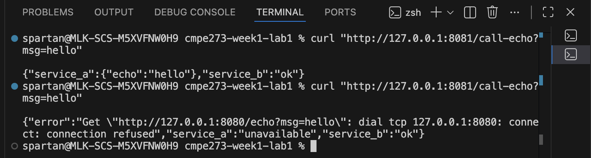

# CMPE 273 Week 1 — Lab 1 (Go HTTP)

Two independent Go services demonstrating a basic distributed system.

## Services

**Service A (Echo)** — localhost:8080
- `GET /health` → `{"status":"ok"}`
- `GET /echo?msg=hello` → `{"echo":"hello"}`

**Service B (Client)** — localhost:8081
- `GET /health` → `{"status":"ok"}`
- `GET /call-echo?msg=hello` → calls Service A and returns combined JSON

## Logging

Both services log: service name, endpoint, status, and latency in milliseconds.

## Timeouts & Failure

Service B uses an HTTP client timeout (1 second) when calling Service A. If Service A is stopped, Service B returns HTTP 503 and logs the error.

## How to Run

**Terminal 1** — run Service A:
```bash
cd go-http/service-a
go mod init service-a
go run .
```

**Terminal 2** — run Service B:
```bash
cd go-http/service-b
go mod init service-b
go run .
```

## Testing

**Success** (both running):
```bash
curl "http://127.0.0.1:8081/call-echo?msg=hello"
```
Response:
```json
{"service_a":{"echo":"hello"},"service_b":"ok"}
```

**Failure** (stop Service A with Ctrl+C, then run same curl):
```bash
curl -i "http://127.0.0.1:8081/call-echo?msg=hello"
```
Response:
```
HTTP/1.1 503 Service Unavailable

{"error":"Get \"http://127.0.0.1:8080/echo?msg=hello\": dial tcp 127.0.0.1:8080: connect: connection refused","service_a":"unavailable","service_b":"ok"}
```

Service B logs:
```
service=B endpoint=/call-echo status=error error="..." latency_ms=0
```

## Screenshots



## What makes this distributed?

The two services run as completely separate programs (different processes on different ports). They talk to each other over HTTP like any client-server application on the internet. You can stop one without killing the other. Service B makes network calls to Service A, so if A goes down, B handles it gracefully instead of crashing. This is the foundation of microservices - independent components that communicate over a network.

## Timeout & Error Handling

**What happens on timeout?**

Service B has a 1-second timeout. If Service A takes longer to respond:
- HTTP client returns a timeout error
- Service B returns HTTP 503
- Log: `service=B endpoint=/call-echo status=error error="context deadline exceeded" latency_ms=1000`

**What happens if Service A is down?**
- Connection refused error immediately
- HTTP 503 Service Unavailable response
- Service B continues running (independent failure)

## Debugging

**Check if services are running:**
```bash
lsof -i :8080  # Service A
lsof -i :8081  # Service B
```

**Test endpoints individually:**
```bash
curl http://127.0.0.1:8080/health  # Service A
curl http://127.0.0.1:8081/health  # Service B
```

**Common issues:**
- Port already in use → kill process or change port
- Connection refused → service not running
- High latency → performance or network issue
